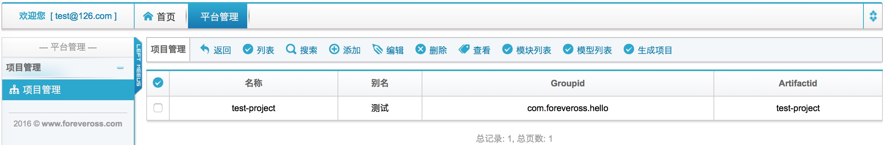
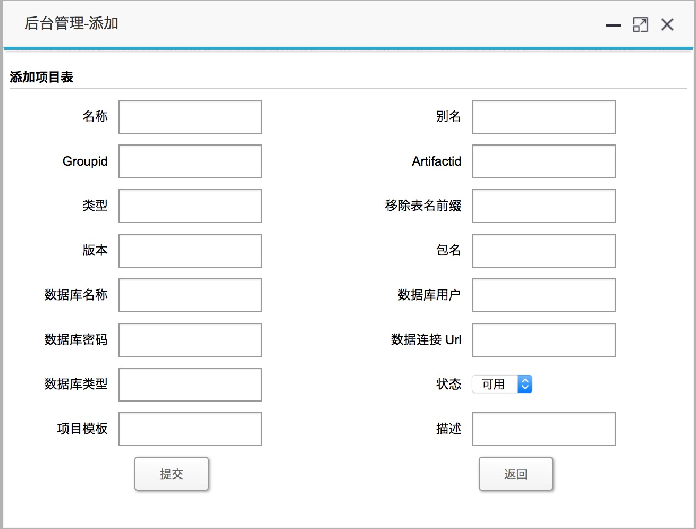
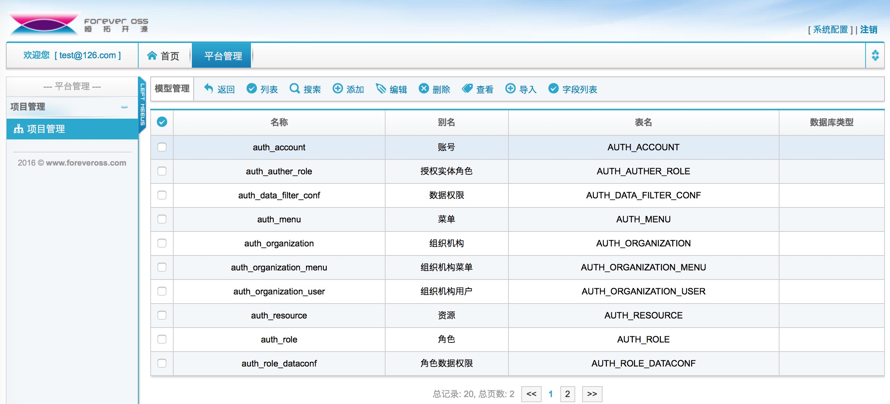
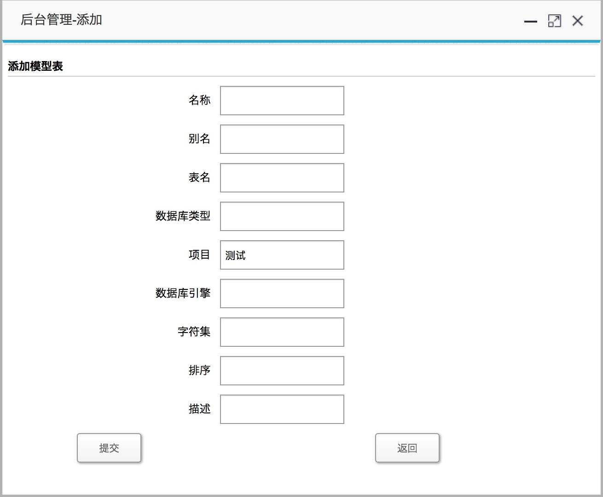
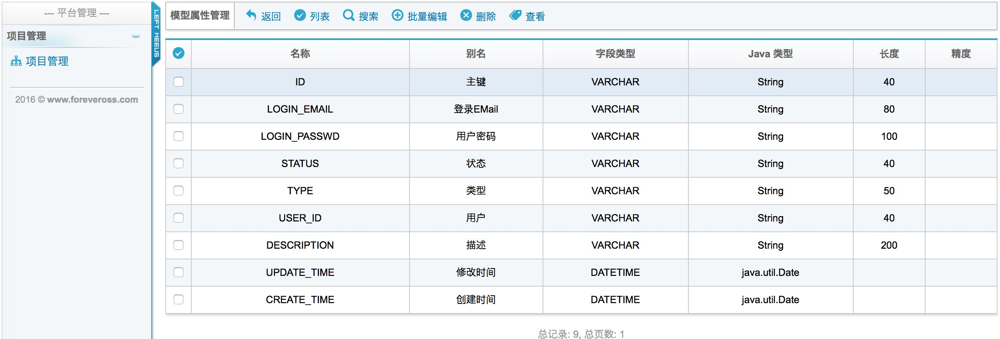
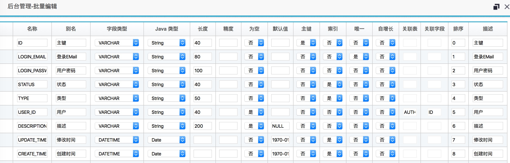
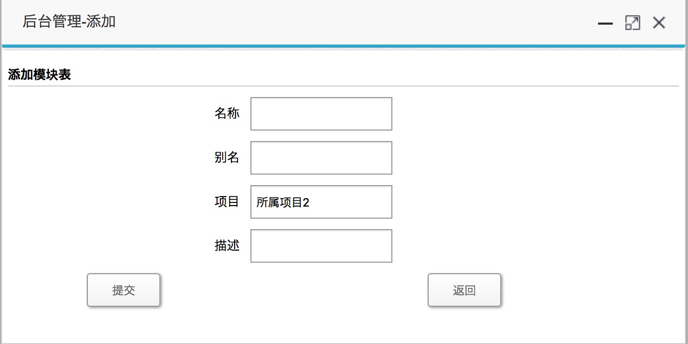
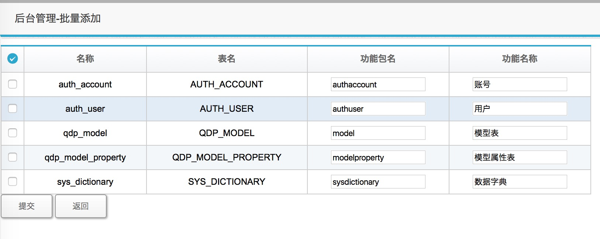
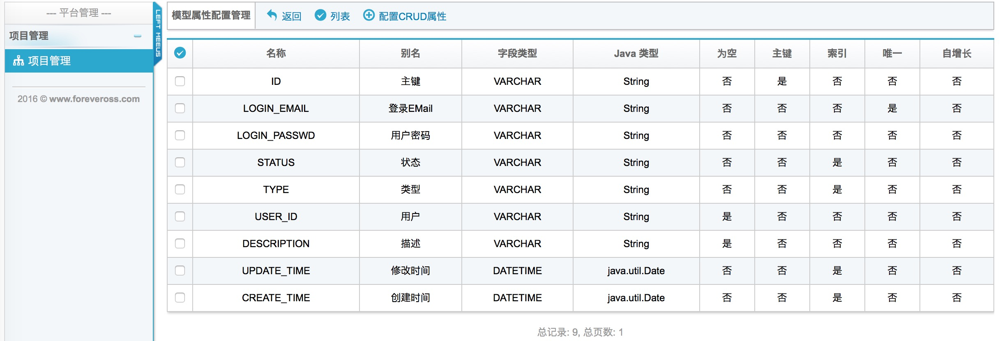
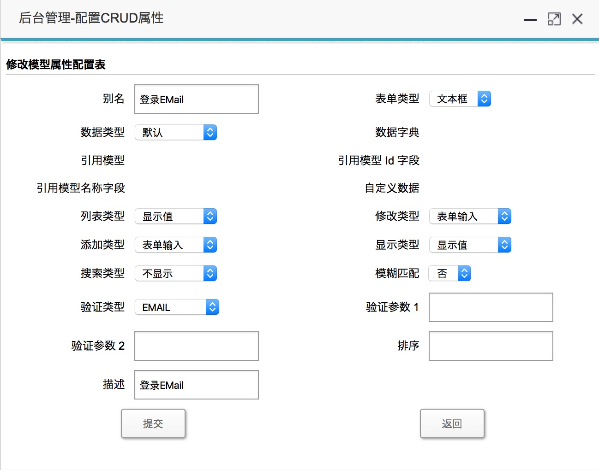

QDP Overview
====

## 平台的功能结构

		           --[模型管理]--[字段管理]
		          |
		[项目管理]--|
		          |
		           --[模块管理]--[功能管理]--[配置CURD管理]--[配置CURD属性]
	          

项目数据模型用于描述数据库表或数据详细信息；一个项目可以包含多个模块，如系统管理、业务模块等，每个模块可以包含多个功能，如权限管理模块包括用户、角色、资源等功能管理，每个功能管理主要包含CRUD功能，其中CRUD功能可以做一些精细配置，以符合业务需要。

-------

### 项目管理

#### 管理界面

#### 添加新项目

#### 字段说明

* 名称
	
		Java项目名称，用户Java项目的名称，目前只允许：字母、数字、下划线，并且必须以字母开头，目前需要与下面【Artifactid】相同
	
* 别名

		项目名称，中文件名称

* Groupid

		对应Maven项目的groupId，必须是合法的Java包名，包名不能包含Java关键字，项目生成时会默认转换成小写，目前需要与下面【包名】相同，【代码：pom.xml】

* Artifactid

		对应Maven项目的artifactId，Java项目名称，目前需要与上面【名称】相同，项目生成时会默认转换成小写，【代码：pom.xml】

* 类型

		目前该为预留项，以后会用作项目的分类使用，项目比较多的时候可以通过类型来归类

* 移除表名前缀

		数据模型，通常为数据中的table，一般都带有表名前缀，如qdp_user, sys_dictionary，如果希望在生成Java类名时把该前缀去除，则需要该项，多个需要移除的前缀使用","号分隔，如：qdp_,sys_，则生成类名为User，Dictionary，不去前缀时生成类名为：QdpUser, SysDictionary
 	
* 版本

		对应Maven项目的version，如：1.0.0，【代码：pom.xml】

* 包名

		Java项目的代码包名前缀，目前需要与上面【Groupid】相同

* 数据库名称

		数据库名称，Oracle数据库则对应为Schema名称，目前尚未使用

* 数据库用户
 	
		数据库连接的用户名称，生成JDBC连接时使用，【代码：src/main/resources/META-INF/spring-app/data-access.xml】

* 数据库密码

		数据库连接的密码，生成JDBC连接时使用，【代码：src/main/resources/META-INF/spring-app/data-access.xml】

* 数据连接 Url

		数据库连接的URL，生成JDBC连接时使用，【代码：src/main/resources/META-INF/spring-app/data-access.xml】

* 数据库类型

		数据库类型，应为：mysql,oracle,sqlserver,db2，目前未使用但会用于生成连接池时使用，【代码：src/main/resources/META-INF/spring-app/data-access.xml】

* 状态

		目前未有启用

* 项目模板

		需要选择生成项目的模板，目前项目模板为统一维护，必须选择一个模板

* 描述

		项目的描述信息
		

-------

### 模型管理

#### 管理界面

#### 添加新模型

#### 字段说明

* 名称

		模型名称，默认为表名即可，目前只允许：字母、数字、下划线，并且必须以字母开头，目前需要与下面【表名】相同
 	
* 别名

		模型别名，中文名称，生成国际化信息时用到

* 表名

		表名称，table名称，目前只允许：字母、数字、下划线，并且必须以字母开头，目前需要与上面【名称】相同

* 数据库类型
 	
		目前在使用导入功能是，需要指定数据库的类型，以便分析导入的SQL脚本，目前仅支持mysql

* 项目

		模型所属的项目，不需要选择

* 数据库引擎

		数据库引擎，目前只对mysql有引擎概念，默认为InnoDB

* 字符集

		数据库字符编码，目前只对mysql有效，默认为UTF-8

* 排序

		用于显示模块的顺序

* 描述

		模块描述信息

### 字段管理

#### 管理界面

#### 添加新模型

#### 字段说明

* 名称

		字段名，对应数据表的column，目前只允许：字母、数字、下划线，并且必须以字母开头
 
* 别名

		字段中文名，用于国际化，在生成表单时作为输入名称，请认真填写
 
* 字段类型

		字段类型，在界面上可以看到的类型只是一些通用类型，比数据库支持的所有类型少

* Java 类型

		字段对应的Java类型，在生成Java类中的字段时使用

* 长度

		对应一些字符串类型，会使用到长度；对应数字类型也可以使用长度，如Number(8)
 
* 精度

		对应数字类型会使用到精度

* 为空

		字段是否允许为空，生成代码时会做非空判断

* 默认值

		字段的默认值，设置默认值为"NULL"时，默认设置

* 主键

		是否为主键，目前只支持一个主键，可以配置多个主键，但代码逻辑需要个人实现

* 索引

		是否添加索引

* 唯一

		是否唯一

* 自增长

		是否自增长，自增长在插入数据时未实现

* 关联表

		外键关联表

* 关联字段

		关联的字段，目前只支持单外键关联

* 排序

		字段显示的顺序，生成代码的顺序等，对用户体验来说是比较重要的，

* 描述

		字段的描述信息
		

-------

### 模块管理

#### 管理界面

#### 添加新模块

#### 字段说明

* 名称

		模块的名称，也是Java包名的一部分，目前只允许：字母、数字，并且必须以字母开头
 	
* 别名

		中文名称，用于生成菜单页面，国际化时使用

* 项目

		模块所属的项目，不能修改

* 描述

		模块的描述

-------

### 功能管理

#### 管理界面

#### 添加新模块

#### 字段说明

* 名称

		模块名称，不用修改

* 表名

		模块的表名，不用修改

* 功能包名

		功能的包路径名称，是Java包名的一部分，目前用于生成URL路径，CRUD页面文件夹

* 功能名称

		功能的名称，中文名称，用于界面和国际化生成

-------

### CRUD配置管理

#### 管理界面

#### CRUD配置

#### 字段说明

* 别名

		中文名称，自动从字段中别名带过来，目前没有使用到

* 表单类型

		其中“弹窗”在点击输入框时会弹出数据列表，以供选择，其他为表单的输入类型

* 数据类型

		“数据词典”，会采用sys_dictionary表的数据，目前还没有使用；“数据模型”，需要配合上面“表单类型”的“弹窗”来使用；“自定义数据”，为自定义的JSON数据，主要用于下拉列表

* 数据字典

		配合上面“数据类型”的“数据词典”使用
 	
* 引用模型

		配置上面的“数据类型”的“数据模型”来使用，表示数据将来源于哪个数据模型（哪个table）

* 引用模型 Id 字段 

		配置上面的“数据类型”的“数据模型”来使用，表示数据将来源于哪个数据模型（哪个table），选择数据后，回传的数据的ID列，如：部门在分配员工时，会弹出员工的选择框，选择员工后会回传员工的指定列数据作为ID，可以选择员工的主键，或员工的工号

* 引用模型名称字段

		配置上面的“数据类型”的“数据模型”来使用，表示数据将来源于哪个数据模型（哪个table），选择数据后，回传的数据的名称列，如：部门在分配员工时，会弹出员工的选择框，选择员工后会回传员工的数据的名称，便于阅读，免得回传值是主键是，只会显示一串字符串，而不知道到底是选择了哪个员工

* 自定义数据

		配置上面的“数据类型”的“自定义数据”来使用，为自定义的JSON数据，主要用于下拉列表，如：{"Y":"是","N":"否"}

* 列表类型

		在显示列表页面时，决定数据的显示形式，“显示值”：以文本方式显示；“表单输入”：以上面“表单类型”定义的类型一致，可用于数据的编辑；“自定义内容”，这个需要配合修改“_fieldDesc.html”，以显示自定义内容；“不显示”：在页面上不显示该字段
 	
* 修改类型

		在显示修改页面时，决定数据的显示形式，同“列表类型”
 	
* 添加类型

		在显示添加页面时，决定数据的显示形式，同“列表类型”

* 显示类型

		在显示详细信息页面时，决定数据的显示形式，同“列表类型”

* 搜索类型

		在显示搜索页面时，决定数据的显示形式，同“列表类型”，但目前仅支持“表单输入”

* 模糊匹配

		在生成代码时，该字段是否生成模糊配置的SQL，目前会区分字母的大小写

* 验证类型

		提供字段的验证，在表单提交时，会对数据进行验证，展现表会对数据进行校验，在模型里也会对数据进行校验

* 验证参数 1

		用于验证的参数，如：输入的最大长度

* 验证参数 2

		用于验证的参数，如：输入的范围，1至9

* 排序

		用于排序

* 描述

		描述信息
		

